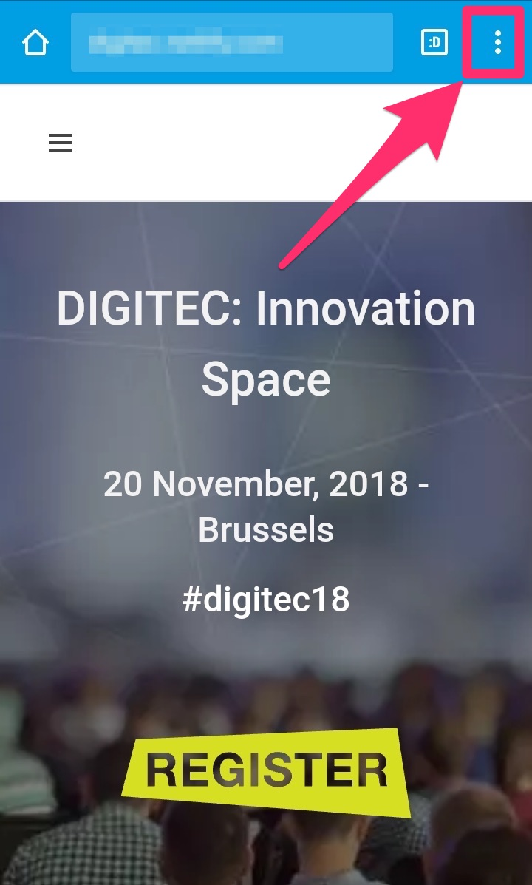
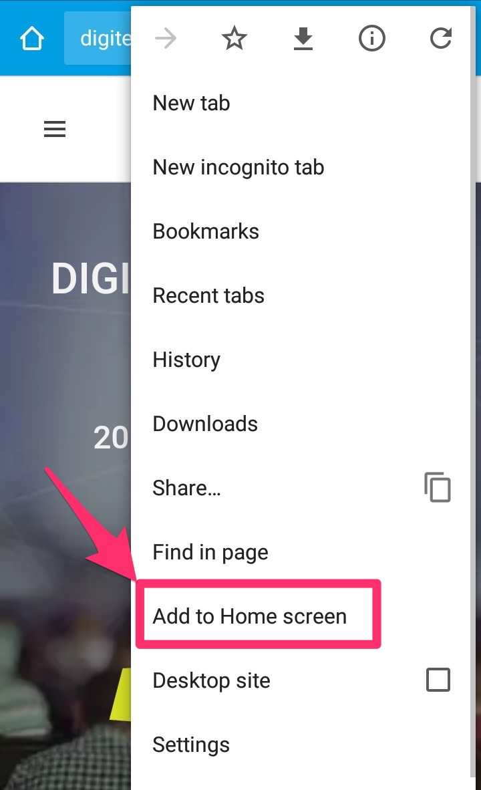
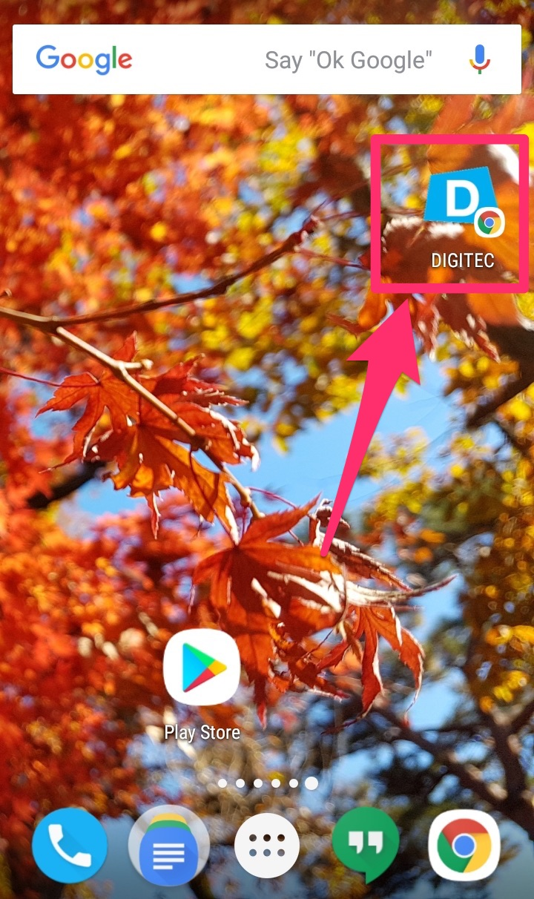
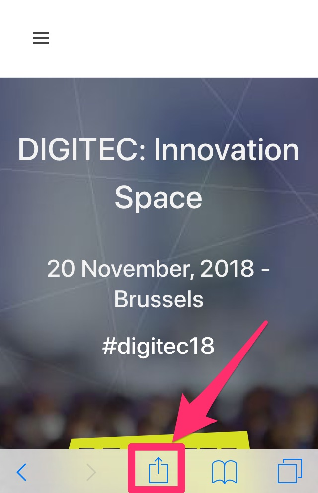
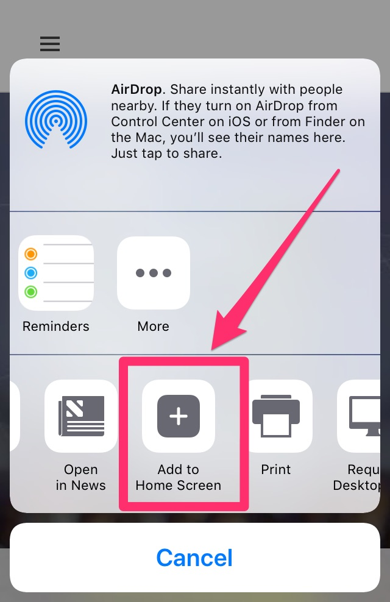
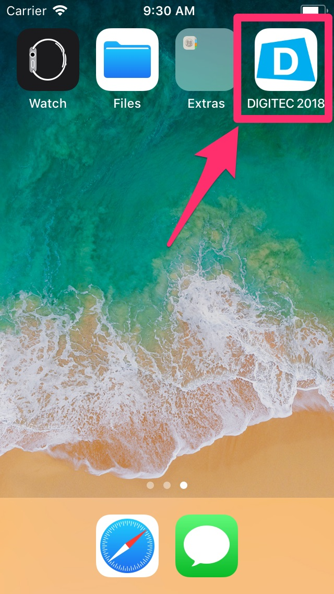

## How to get to SQUARE Brussels?

[SQUARE](https://www.square-brussels.com/en/contact.html) - Brussels Meeting Centre

Mont des Arts / Kunstberg

B-1000 Brussels, Belgium

## Disabled access

Visitors with mobility issues should use the entrance located in the **SQUARE terrace**, as indicated in [venue's website](https://www.square-brussels.com/en/about-us/access.html#walk).

## Contacts

For general questions about DIGITEC: [DIGITEC CONFERENCE TEAM](mailto:DIGITEC-CONFERENCE@ec.europa.eu)

For registration questions: [SCIC CONFERENCE REGISTRATION](mailto:SCIC-CONF-REGISTRATION@ec.europa.eu)

## DIGITEC live

Follow DIGITEC on Twitter ([\#digitec18](https://twitter.com/hashtag/digitec16)) or via the webstream on 20th of November.

## DIGITEC on your mobile

Choose and save your favorite sessions to [My DIGITEC](https://europa.eu/digitec/my-digitec).

On iOS or with Chrome for Android, you can add DIGITEC to your home screen.

### Android

With Chrome for Android, go to the website and open Chrome's menu.

Then, click on the "Add to Home screen" link.

You will be asked to give a name to the app and then, a new icon will be created on your home screen.

### iOS

With Safari for iOS, go to the website and tap on the "Share" icon at the bottom (the square with an arrow pointing upwards).

Select the "Add to Home Screen" icon.

Give your link button a name and click "Add" - your new icon will appear on your home screen.

